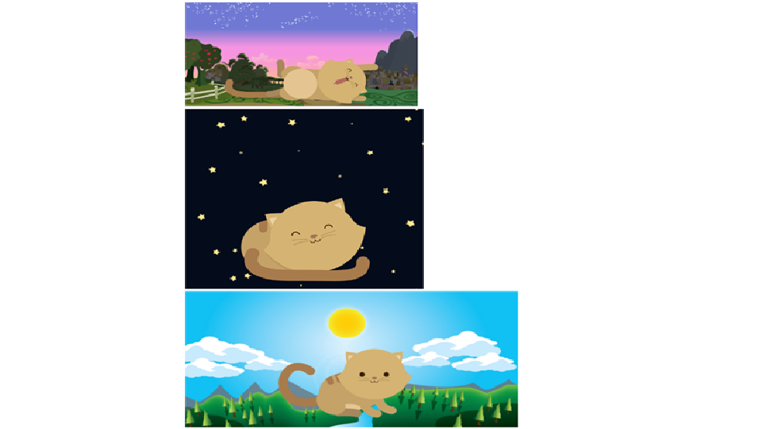

# KITTEN 

Trabajo realizado por:
* Gloria Ramos

Herramientas utilizadas:
* CSS
* HTML
* ASSETS

Finalidad:

Poner en practica nuestros conocimientos me media query, para poder crear paginas responsivas.

* Modelo del producto final:

